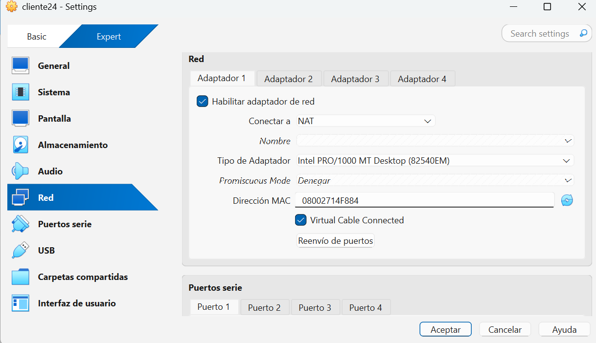
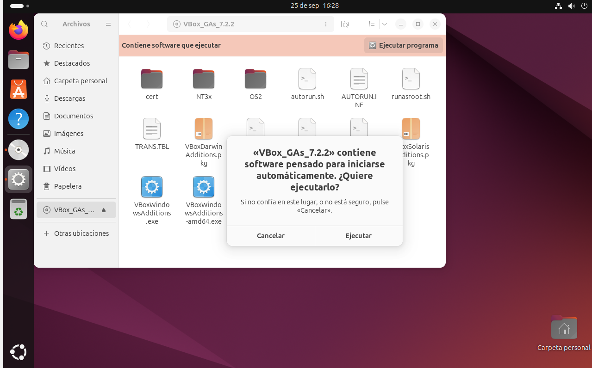
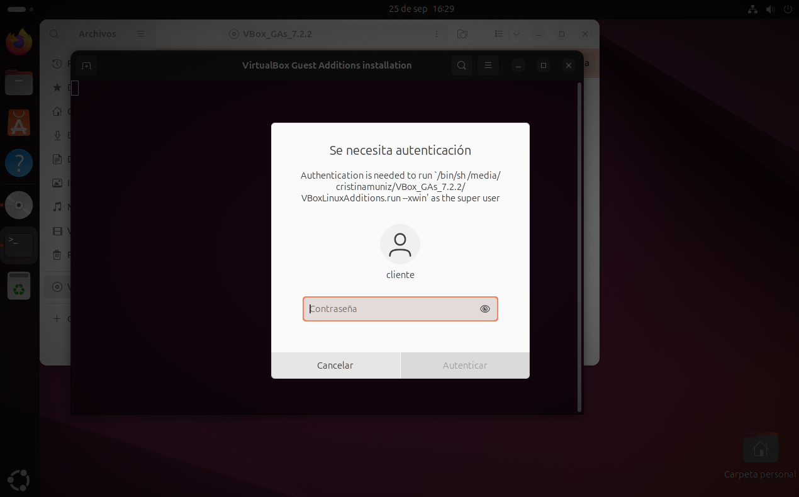
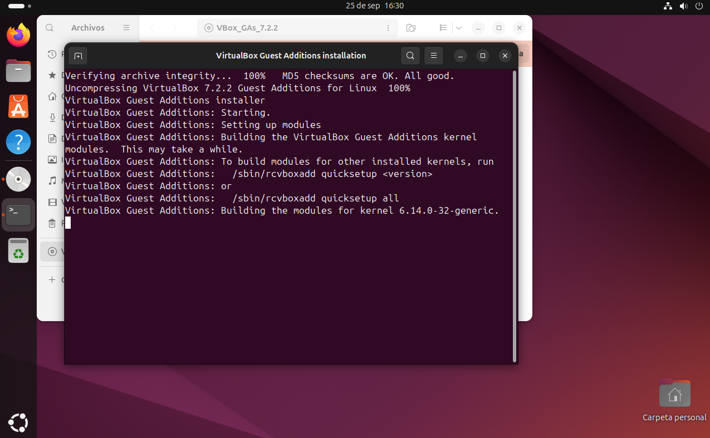
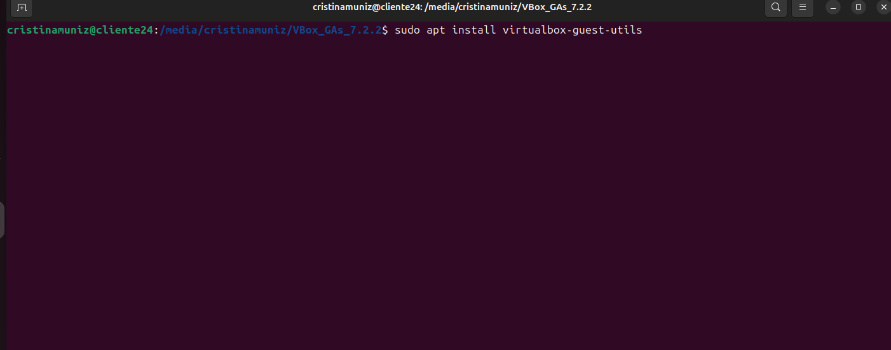
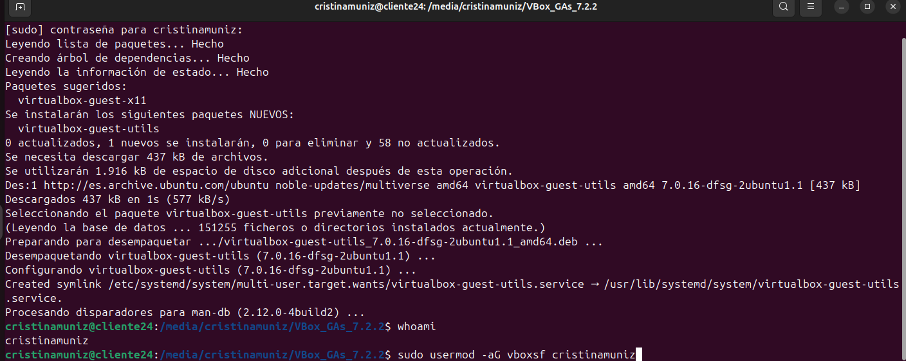
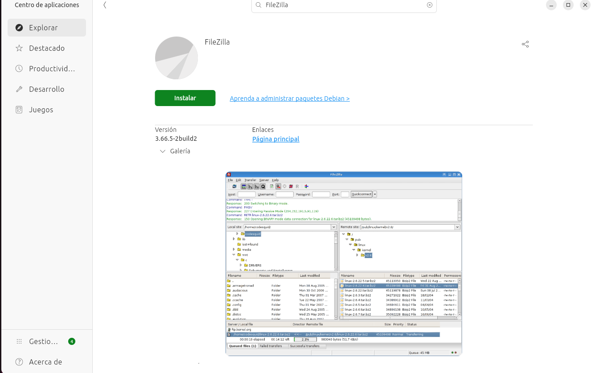

# Instalación de la máquina cliente de Ubuntu

[TOC]

## 1. Requerimientos hardware

Para comenzar buscamos en la página de https://ubuntu.com/download que tipo de sistema operativo queremos descargar. En nuestro caso será Ubuntu Desktop 

En la propia página también te explica que requerimientos para el hardware se necesitan. Esto lo usaremos como guía para crear nuestra maquina virtual.

## 2. Configuración de ubicaciones

Para no saturar nuestro equipo, crearemos una carpeta en nuestra unidad de `disco local C` una carpeta para albergar todo lo referente a las máquinas virtuales.

Ruta:

`disco local C > usuarios > creamos una carpeta maquina virtual Ubuntu`

En mi caso como lo estoy haciendo desde mi ordenador en mi casa la ruta para mi es diferente.

`Disco local C > usuarios > Cris > VirtualBox VMs > UbuntuDesktop`

## 3. Creación de una máquina virtual Ubuntu

Abrimos Virtual Box y hacemos click en `nueva.` y comenzamos con la configuración.

**Nombre y sitema operativo:**

- Marcamos la opcion de `omitir instalacion desatendida`

  

**Hardware:**

**Disco Duro:**

## 4. Otras configuraciónes 

- Deshabilitar audio.

  

  

- Escogemos red Nat para el adaptador.

## 5. Instalación de Ubuntu desktop

Primero debemos arrancar nuestra máquina virtual, una vez hecho esto nos saldra ya una ventana que nos idica si queremos intentar instalar Ubuntu, presionamos aceptar y comenzamos a instalar seguin los pasos que nos van indicando.

- Accesibilidad en Ubuntu : no ponemos nada.

- Eleccion de indioma de teclado: Español

  

  

- Conectarse a internet: Utilizar conexión por cable.

- Queremos instalar Ubuntu: si

  

  

- Instalacion interactiva: si.

- Aplicaciones a instalar: Selcción predeterminada.

- ¿Como quieres instalar Ubuntu?:  borrar disco e instalar Ubuntu.

  

  

- Crear cuenta

  

  

  

- Huso horario : Gijon (Asturias, Spain)

  

  Aqui empezará la instalacion de todo lo que hemos ido configurando. Esto tarda unos minutos. Una vez que ha terminado nos pied reiniciar.

  

  

## 6. Instalar Guest additions

Son un conjunto de drivrs y utilidades que se instalan dentro del sitema operativo invitado para mejorar la integracion con el sistema anfitrión.

Usos:

- Pantalla completa y resolucion dinámica.

- Portapapeles Bidireccional.

- Arrastrar y soltar archivos.

- Mejor rendimiento gráfico y de ratón.

- Carpetas compartidas.

  

En la ventana de la máquina virtual nos vamos a `Dispositivos > Instalar imagen de CD de las Guest Additions`

Clicamos en el CD que nos aparece y después a `Ejecutar programa` y nos saldra el siguiente mensaje:

Nos pide la autenticación.

Cuando nos disponemos a instalar nos sale un error porque nos falta instalar `bzip2 tar`. Abrimos una nueva terminal y ejecutamos el siguiente comando: `sudo apt install bzip2 tar`.

Ahora si podemos volver a ejecutar las guests additions y seguir con la instalación.

> Si por alguna razón con los pasos anteriores no se instalan las guests additions se pùede hacer directamente desde la consola con `sudo apt install virtualbox-guest-utils`
>
> 
>
> 

Una vez que hemos instalado esto es bueno actualizar el sitema para ello abrimos una nueva terminal y ejecutamso los siguientes comandos:

`Sudo apt update` : para refrescar la lista de paquetes disponibles.

`Sudo apt upgrade`: para descargar e instalar todas las actualizaciones de software disponibles.

Ejecutamos el comando `whoami` para saber cual es el nombre de usuario efectivo. En este caso es **cristinamuniz**

Ejecutamos el comando `sudo usermod -aG vboxsf cristinamuniz` para poder tener carpetas compartidas entre el sistema anfitrión y el invitado

Reiniciamos la máquina para que todo quede instalado correctamente.

## Instalación de filezilla

Es una aplicación de software para transferir archivos entre el ordenador local y un servidor remoto a traves de internet. Se conoce como un cliente FTP.

Usos:

- Administración web: subir archivos  de una página web (HTML, CSS, imágenes, etc.) desde tu PC a un web hosting.
- Copias de seguridad: descargar una copia de los archivos de tu sitio web  desde el servidor a tu ordenador local.
- Gestión de archivos: renombrar, eliminar, mover o cambiar permisos (CHMOD) de archivos y carpetas en el servidor remoto.
- Edición rápida: permite editar archivos de configuración o código directamente en el servidor.

Abrimos el centro de aplicaciones, buscamos el filezilla y lo instalamos

