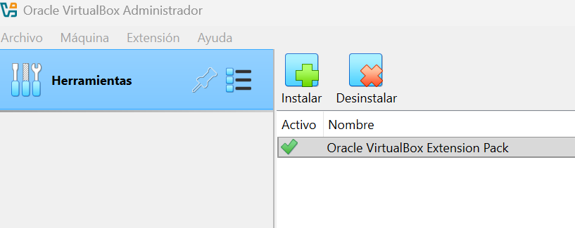
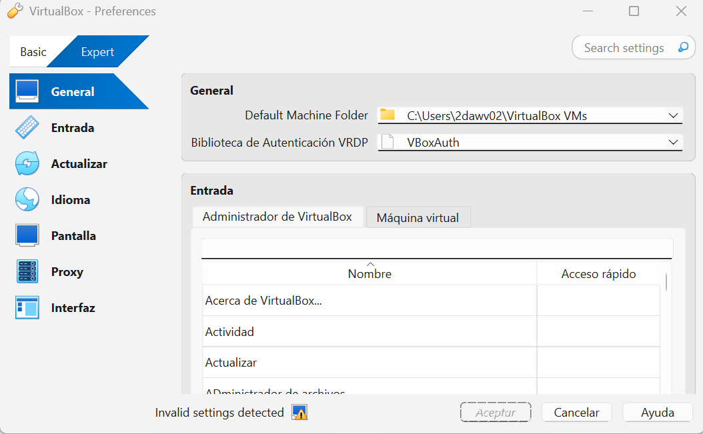
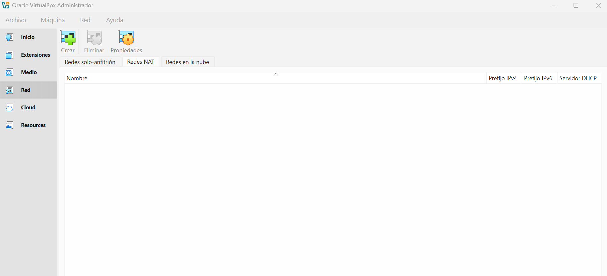
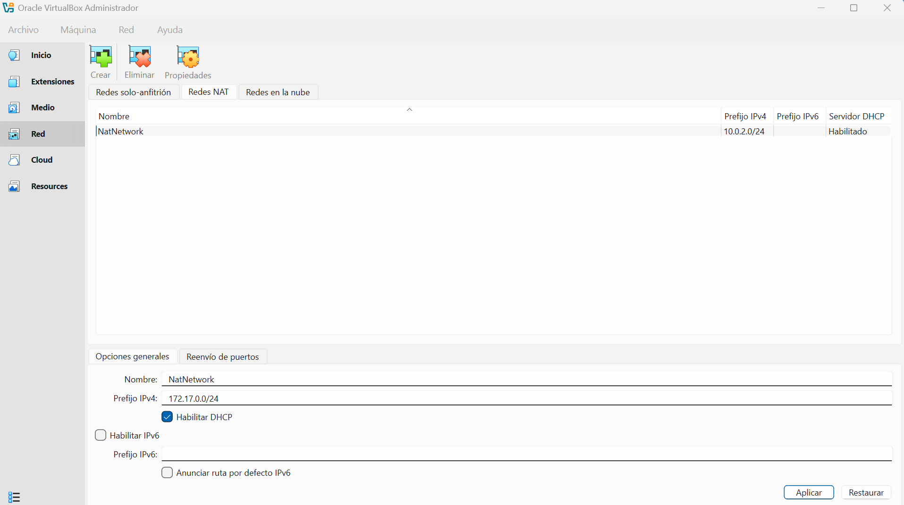
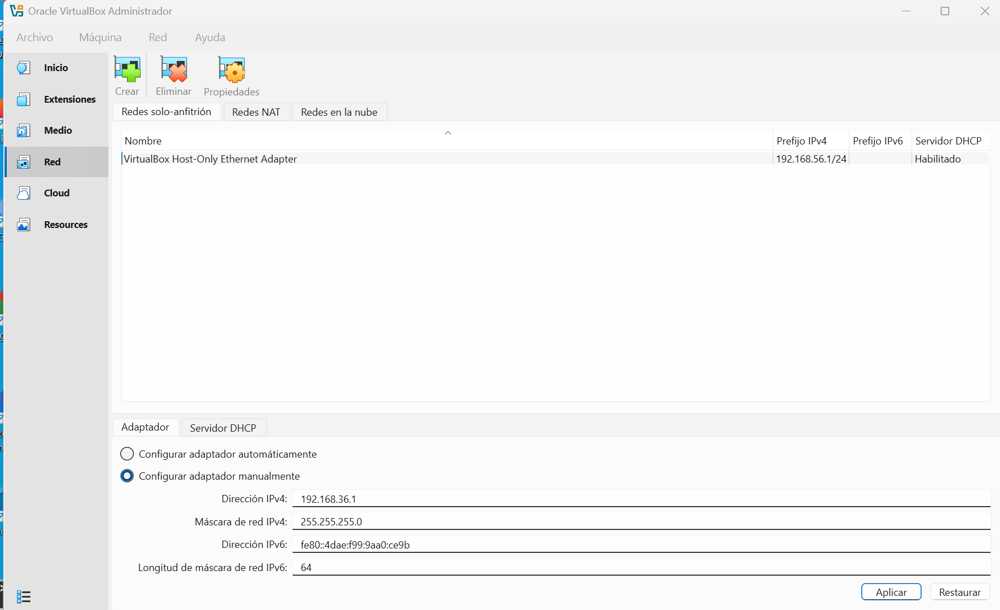
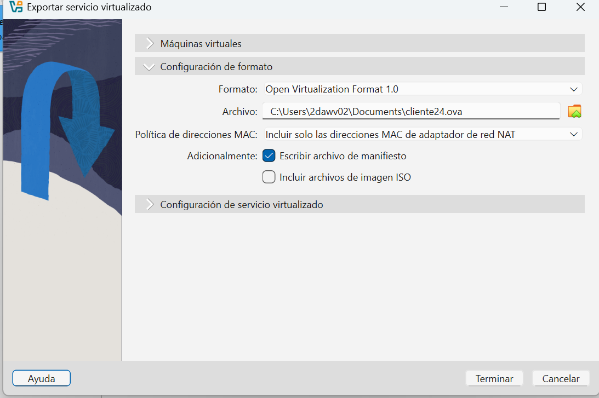

# Configuración de Virtual Box

[TOC]

## 1. Configuración de Virtual Box

Para realizar todo este proceso debemos instalar la aplicacion de VirutalBox, escogemos para que plataforma lo queremos instalar y también nos descargaremos la ***"Extension pack*"**

Una vez lo hemos instalado, abrimos la aplicación y comprobamos que tiene el paquete de extensiones de Virtual box

Trabajaremos siempre en modo experto

## 2. Configurar nuestra red NAT

Trabajaremos con el adaptador de red  en modo `Red NAT` para poder conectar dos máquinas 

## 3. Configurar la red solo-anfitrión

Esta red nos sirve para poder conectar la máquina <u>anfitrión</u> , es decir nuestra máquina *REAL*, con una máquina virtual.

Aqui debemos configurar manualmente nuestra direccion IPv4. En nuestro caso sera `192.168.36.1` y la máscara de `255.255.255.0`

## 4. Crear una máquina virtual

Una vez hemos configurado nuestra aplicacion de Virtual Box ya solo queda crear una máquina virtual. Para ello debemos escoger en el menú la opcion de "***Nueva***" y comenzar a configurar la máquina virtual.

Cuando le damos a ese boton de "Nueva" nos saldrá una ventana para comenzar la configuración.

Aqui empezaremos a definir como será nuestra máquina virtual:

**Nombre y Sitema Operativo:**

- El nombre de la máquina.
- En `carpeta` le asignaremos la ubicación donde queremos que se encuentre nuestra máquina.
- En `imagen ISO` escogeremos nuestra imagen de la maquina que queremos crear, bien sea Windows Server o Desktop, Linux Server o Desktop , etc. Esta imagen se tendrá que descargar previamente de internet en las páginas oficiales de cada proveedor.
- En `tipo` le asignaremos que tipo de máquina va a ser. (Microsoft Windows, Linux, Solaris...).

- En `versión` ya nos sale por defecto la que corresponde una vez escogemos en el `tipo.`

  

**Hardware**:

- En `memoria base`escogeremos la capacidad de memoria de nuestra máquina según las especificaciones que nos da el proveedor. Esta informacion se encuentra en la propia página cuando buscamos la ISO para descargar.
- En `procesadores` se hace lo mismo que en el punto anterior.

**Disco Duro:**

- Marcamos la opcion de `crear un disco duro virtual ahora` y escogemos la acntidad de MB/GB/TB que necesitamos para el disco.
- Aqui tambien escogemos que nuestro disco va a ser  `VDI` (VirtualBox Disk Image).

Una vez hemos realizado todas estas operaciones le damos a terminar y ya tendremos creada nuestra máquina. En este caso se muestra una máquina de Windows Server para mostrar como ejemplo.

## 5. Configuraciones adicionales

Una vez creada la máquina podemos pasar a configurar otras cosas como por ejemplo el `audio`

También podemos configurar las `carpetas compartidas`, por si queremos tener una carpeta en nuestro ordenador anfitrión para poder guardar documentos de nuestra máquina virtual.

## 6. Exportar maquina

Esta opcion es muy útil si queremos mover nuestra máquina virtual de un ordenador anfitrión a otro o si queremos que alguien copie nuestra máquina.

Hay que acceder a el `administrador de VirtualBox > archivo > exportar servicio virtualizado.`

Nos saldrán las maquinas que tenemos y escogeremos la que qeremos exportar. Una vez hecho esto nos proporcionara un `ova` que es el formato donde se encuentra nuesta máquina.

