# Repaso de Linux

[TOC]


## Capitulo 2- Ficheros y directorios I

Directorios más importantes de un sistema Linux

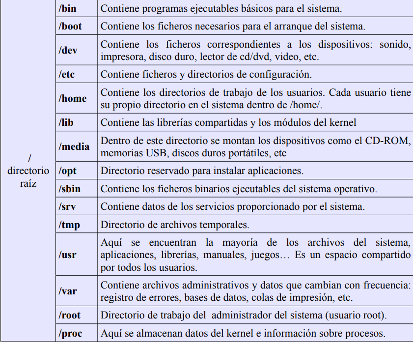

### 2.3 Visualización, creación y cambio de directorio (`pwd, ls, cd, mkdir`)

`pwd` muestra el directorio actual.

```bash
$ pwd
```

------

`ls` Muestra el contenido del directorio actual (listar). No se muestran los ocultos.

```bash
$ ls
```

Se pueden añadir opciones al comando:

 `-a` (muestra todos lo archivos incluyendo los ocultos)

```bash
$ ls -a
```

`-l` (Muestra un listado detallado  con la última fecha de modificación de cada archivo, tamaño, etc)

```bash
$ ls -l
```

Para obtener un listado de todos los comandos adicionales de `ls` :

```bash
$ man ls											
```

------

`cd` permite cambiar de directorio. Si se utiliza sin niimgún argumento, cambia al directorio personal, sino hay que indicarle una **ruta** 

Si estoy en mi directorio no necesito poner la `/` 

Para moverme al directorio superior se usa el comando y `..`

```bash
$ cd
$ cd /Documentos
$ cd Documentos 
```

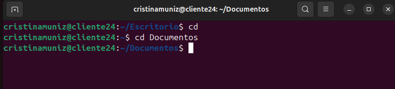

------

`mkdir` crea un directorio

```bash
mkdir prueba1
```

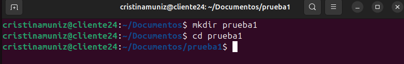

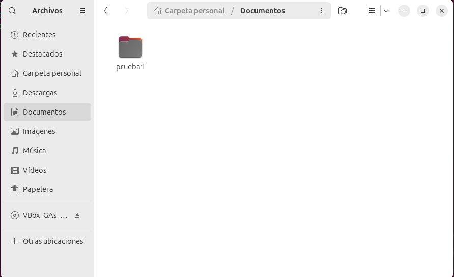


### 2.4 Visualización de ficheros (`cat, more, less, head, tail`)

`cat`Muestra por pantalla el contenido de un fichero

```bash
$ cat /var/log/dmesg
```

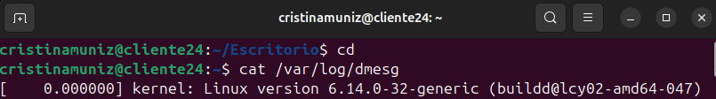

------

`more`Hace lo mismo que `cat` pero muestra el fichero pantalla a pantalla hasta que el usuario pulsa la tecla **<espacio>** 

```bash
$ more /var/log/dmseg
```

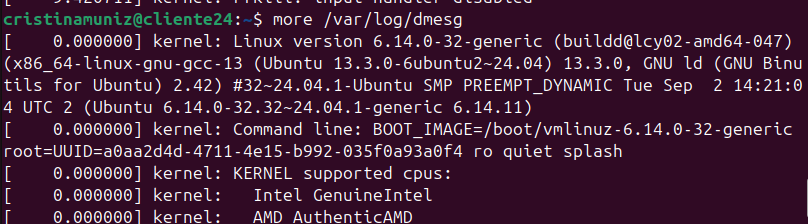

------

`less`Permite moverse hacia delante y hacia atrás dentro del fichero

```bash
$ less /var/log/dmseg
```


> Para salir de cualquiera de estos comandos pulsamos la tecla  <**q**> y volvemos al simbolo de sistema

------

`head` Muestra la primera lineas del fichero

```bash
$ head /boot/grub/menu.lst
```

------

`tail` Muestra las ultimas lineas del fichero

```bash
$ tail /boot/grub/menu.lst
```

> Por defecto muestran 10 lineas, pero se puede cambiar con la opcion `-n`
>
> ```bash
> $ tail -n4 /boot/grub/menu.lst
> ```
>
> 


### 2.5 Edición de ficheros (`touch, vi, ee, mcedit`)

`touch` Permite crear un fichero vacío

```bash
$ touch prueba2.txt
```

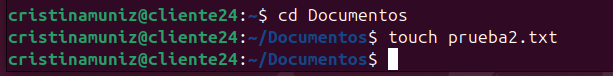

------

`ee` Es un editor de texto rudimentario

```bash
$ ee prueba2.txt
```

> Este código está deprecado

------

`mcedit` Es otro editor de código pero más sofisticado

```bash
$ sudo apt-get install mc
$ mcedit prueba.txt
```

------

#### Ejercicios  capitulo 2

1. ¿En qué directorio se encuentran los ficheros de configuración del sistema? 

   ```bash
   $ ls /usr/bin
   ```

   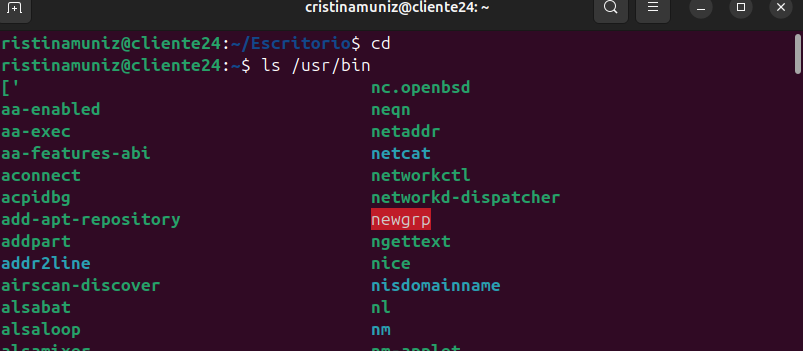

   

   2.Para entrar en un sistema Linux hace falta a) nombre de usuario, contraseña y dirección IP, b) nombre de usuario y contraseña o c) únicamente una contraseña.

   b. nombre de usuario y contraseña

3. Muestra el contenido del directorio actual

   ```bash
   $ ls
   ```

   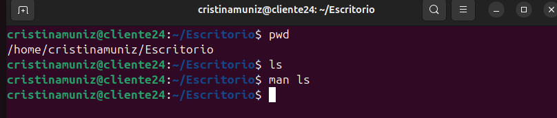

   4.Muestra el contenido del directorio que está justo a un nivel superior
   
   ```bash
   $ ls ..
   ```
   
   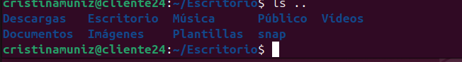
   
   
   
   5.¿En qué día de la semana naciste?, utiliza la instrucción `cal` para averiguarlo
   
   ```bash
   $ cal noviembre 1985
   ```
   
   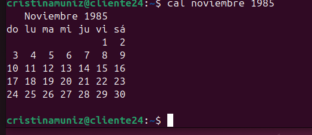
   
   6.Muestra los archivos del directorio `/bin`
   
   ```bash
   $ ls /bin
   ```
   
   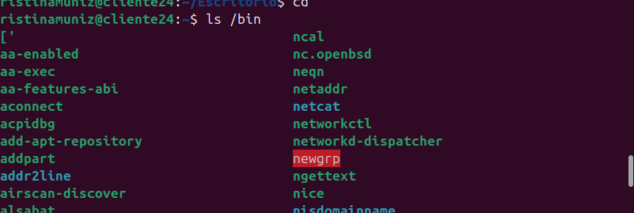
   
   7.Suponiendo que te encuentras en tu directorio personal `(/home/nombre),` muestra un listado del contenido de `/usr/bin` a) con una sola línea de comando, b) moviéndote paso a paso por los directorios y c) con dos líneas de comandos.
   
   a) 
   
   ```bash
   $ ls /usr/bin
   ```
   
   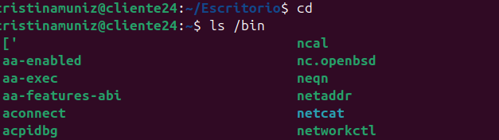
   
   b)
   
   ```bash
   $ cd ..
   cd ..
   cd usr
   cd bin
   ls
   ```
   
   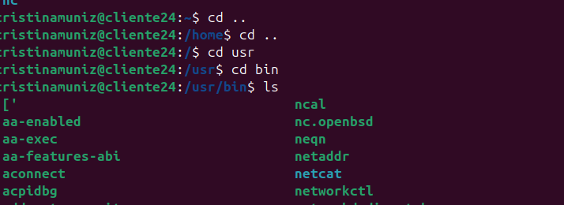
   
   c)
   
   ```bash
   $ cd /usr/bin
   ls
   ```
   
   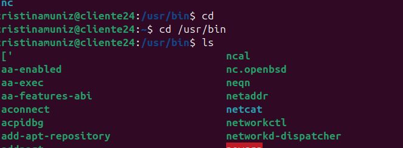
   
   8.Muestra todos los archivos que hay en `/etc` y todos los que hay dentro de cada subdirectorio, de forma recursiva (con un solo comando).
   
   ```bash
   $ ls -R /etc
   ```
   
   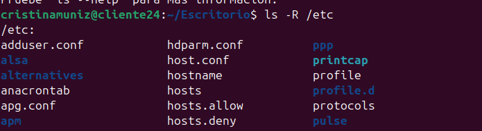
   
   
   
   9.Muestra todos los archivos del directorio `/usr/X11R6/bin` ordenados por tamaño (de mayor a menor). Sólo debe aparecer el nombre de cada fichero, sin ninguna otra información adicional.
   
   > Este no se puede hacer porque no tenemos el directorio X11R6
   
   10.Muestra todos los archivos del directorio `/etc` ordenados por tamaño (de mayor a menor) junto con el resto de características, es decir, permisos, tamaño, fechas de la última modificación, etc. El tamaño de cada fichero debe aparecer en un formato “legible”, o sea, expresado en Kb, Mb, etc.
   
   ```bash
   $ ls -Slh /etc
   ```
   
   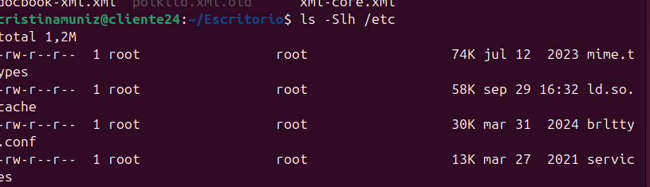
   
   
   
   11.Muestra todos los archivos del directorio `/bin` ordenados por tamaño (de menor a mayor). Sólo debe aparecer el tamaño y el nombre de cada fichero, sin ninguna otra información adicional. El tamaño de cada fichero debe aparecer en un formato “legible”, o sea, expresado en Kb, Mb, etc
   
   ```bash
   $ ls -Sshr /bin
   ```
   
   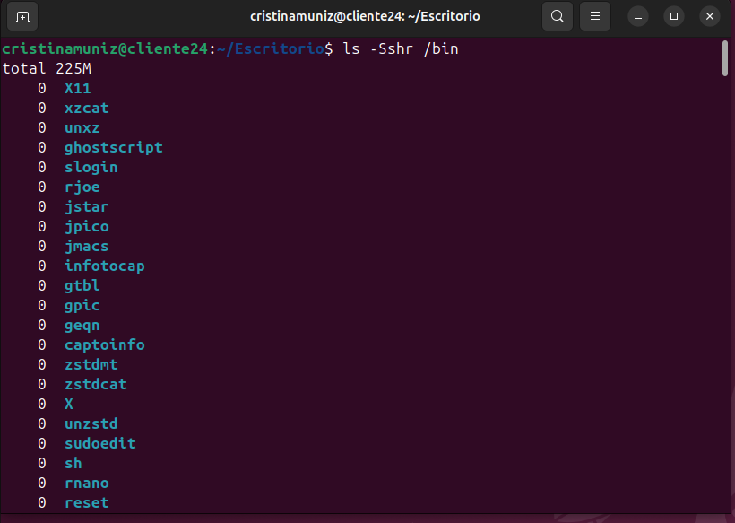
   
   
   
   12.Muestra el contenido del directorio raíz utilizando como argumento de ls una ruta absoluta
   
   ```bash
   $ ls /
   ```
   
   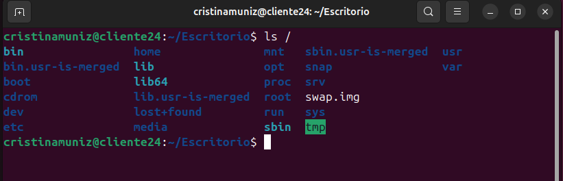
   
   13.Muestra el contenido del directorio raíz utilizando como argumento de `ls` una ruta relativa. Suponemos que el directorio actual es `/home/elena/documentos`
   
   ```bash
   $ ls ../ ../ ..
   ```
   
   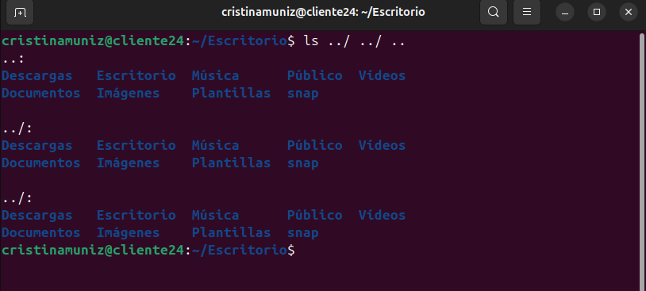
   
   
   
   14.Crea el directorio gastos dentro del directorio personal.
   
   ```bash
   $ mkdir gastos
   ```
   
   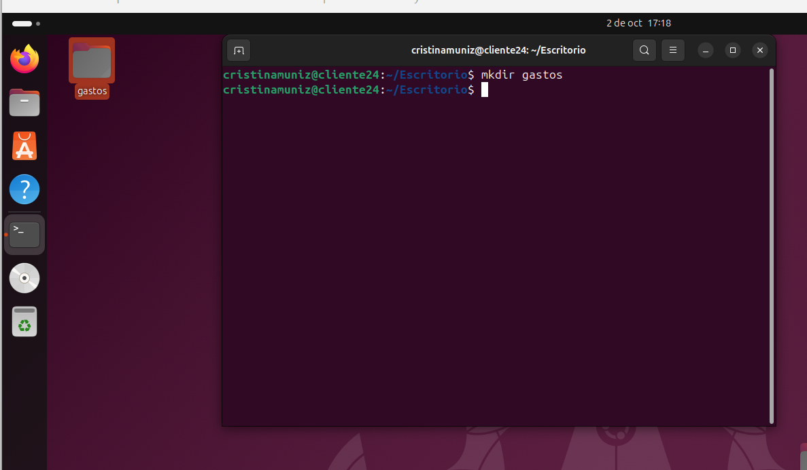
   
   
   
   15.¿Qué sucede si se intenta crear un directorio dentro de `/etc`?
   
   Un usuario "normal " no puede crear un directorio dentro de `/etc`, le saldría in error *"Permiso denegado"*.
   
   Solo el usuario con privilegios de administrador  `root` puede hacerlo. Esto se hace para evitar que otros usuarios causen problemas.
   
   
   
   16.Muestra el contenido del fichero `/etc/fstab`
   
   ```bash
   $ cat /etc/fstab
   ```
   
   
   
   17.Muestra las 10 primeras líneas del fichero `/etc/bash.bashrc`
   
   ```bash
   $ head /etc/bash.bashrc
   ```
   
   
   
   18. Crea la siguiente estructura de directorios dentro del directorio de trabajo personal:
   
       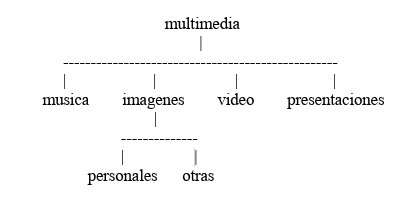
   
       ```bash
       $ mkdir multimedia 
       $ cd multimedia/ ~/multimedia
       $ mkdir musica imagenes video presentaciones ~/multimedia
       $ cd imagenes/ ~/multimedia/imagenes
       $ mkdir personales otras
       ```
   
       
   
   19.Crea un fichero vacío dentro del directorio musica, con nombre `estilos_favoritos.txt`
   
   ```bash
   $ cd 
   $ cd multimedia/musica 
   $ touch estilos_favoritos.txt
   ```
   
   
   
   20.Utiliza tu editor preferido para abrir el fichero `estilos_favoritos.txt` e introduce los estilos de música que más te gusten. Guarda los cambios y sal.
   
   ```bash
   $ vi favoritos.txt 
   $ i 
   electrónica 
   ambient 
   folk 
   clásica 
   pop 
   $ ESC:w 
   $ :q
   ```
   
   
   
   21.Muestra todo el contenido de `estilos_favoritos.txt`
   
   ```bash
   $ cat estilos_favoritos.txt
   ```
   
   
   
   22.Muestra las 3 primeras líneas de `estilos_favoritos.txt`
   
   ```bash
   $ head -n3 estilos_favoritos.txt
   ```
   
   
   
   23.Muestra la última línea de `estilos_favoritos.txt`
   
   ```bash
   $ tail -n1 estilos_favoritos.txt
   ```
   
   
   
   24.Muestra todo el contenido del fichero `estilos_favoritos.txt` excepto la primera línea. Se supone que no sabemos de antemano el número de líneas del fichero.
   
   ```bash
   $ tail -n+2 estilos_favoritos.txt
   ```
   
   
   
   

## Capítulo 3 - Ficheros y Directorios II

### 3.1 Caracteres comodín

Realizar acciones en muchos archivos a la vez:

```bash
$ cat docu1 docu2 docu3 docu4 docu5 docu6
```

------

Creación de patrones para no escribir tanto. Se  usan **símbolos comodín**, en nuestro caso se usa :

```bash
$ cat docu[1-6]
```

------

Si se quiere mostrar todos los documentos:

```bash
$ cat docu*
```

El caracter`*`representa cualquier combinacion de caracteres, incluso cadena vacía. Este caracter se puede colocar en cualquier lugar.

**Ejemplo:** Mostrar todos los ficheros que empiezan por *"a"* ye terminan por *"s"* dentro de un directorio:

```bash
$ ls /usr/bin/a*s
```

------

El símbolo `?` reperesenta un caracter cualquiera.

**Ejemplo:** Muestra todos los ficheros del directorio `/usr/bin` que empiezan por *"g"*, sgue cualquier caracter, liego sigue una *"o"* y termina con cualquier cadena de caracters omcluida cadena vacía.

```bash
$ ls /usr/bin/g?o*
```

------

Los corchetes `[]` se usan parecido a el `?` pero especifican un poco mas.

**Ejemplo:** `[adfg]` significa cualquiera de los caracteres  *"a"*, *"d"*, *"f"* o *"g"*.


### 3.2 Copia y borrado de ficheros `(cp, mv, rm)`

`cp` se utiliza para copiar ficheros. Se puede copiar uno muchos, tanto ficheros como directorios. Se pueden usar simbolos comodín.

En este proceso intervienen 3 factores: <u>Lo que se copia, la ruta de origen y al ruta de destino</u>

**La ruta de origen se especifica junto a lo que se quiere copiar**

**Ejemplo:** copiar el fichero `hosts`, que se encuentra en el directorio `/etc` al directorio `/home/alumno/pruebas`

```bash
$ cp /etc/hosts /home/alumno/pruebas/
```

Si no se especifica la rua de origen (toma por defecto el directorio actual):

```bash
$ cp *.odt textos/
```

Especificar como directorio de destino el directorio actual (se utiliza el caracter `.`:

```bash
$ cp /usr/bin/g* .
```

------

`mv` se utiliza para mover y para cambiar de nombre. Estas acciones se pueden hacer por separado o juntas.

**Ejemplo:** Cambiar el nombre `mi_texto.txt` por `carta.txt`

```bash
$ mi_texto.txt carta.txt
```

**Ejemplo**: mover `carta.txt` al directorio `Documentos`

```bash
$ mv carta.txt Documentos/
```

**Ejemplo:** hacerlo todo a la vez.

```bash
$ cd Documentos/ ~/Documentos
$ mkdir correspondencia ~/Documentos
$ mv carta.txt correspondencia/carta01.txt 
```

------

`rm`  se usa para borrar ficheros. NO SE PUEDEN RECUPERARA UNA VEZ BORRADOS.

**Ejemplo:** borrar todos los archivos con extension `txt` del directorio actual.

```bash
$ rm *.txt
```


### 3.3 Copia y borrado de directorios `(cp, mv, rm)`

Se hace igual que con los ficheros pero hay que tener en cuenta que los directorios (carpetas) pueden contener dentro también varios ficheros u otros directorios. Por lo que si se quiere copiar un fichero completo se debe hacer de forma recursiva con la opcion `-R`

**Ejemplo:**

```bash
$ cp -R multimedia/* multimedia2 
$ ls -R multimedia2 
multimedia2: imagenes  musica  presentaciones  video 
multimedia2/imagenes: otras  personales 
multimedia2/imagenes/otras: 
multimedia2/imagenes/personales: 
multimedia2/musica: estilos_favoritos.txt 
multimedia2/presentaciones: 
multimedia2/video: 
```

------

El comando `mv` funciona de forma análoga a `cp, mueve en vez de copiar. Para renombrar funciona igual que los ficheros:

```bash
$ mv multimedia2 multimedia_copia
```

------

El comando `rm` borra directorios pero hay que hacerlo de forma recursiva `-R`. Se introduce la opción `-f` para que nos pida confirmación antes de proceder al borrado.

```bash
$ rm -Rf multimedia_copia/
```


### Resumen

Simbolos comodín

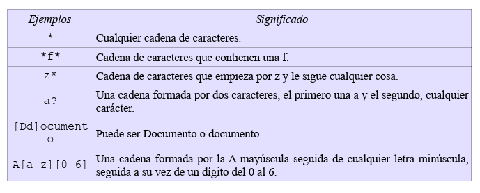

Comandos

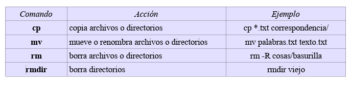

------

#### Ejercicios capítulo 3

1.Muestra todos los archivos del directorio actual que son imágenes `jpg.`

```bash
$ ls *.jpg
```


2.Muestra todos los archivos del directorio `/usr/bin` que empiecen por la letra `j.`

```bash
$ ls /usr/bin/j*
```


3.Muestra los archivos que empiecen por `k` y tengan una a en la tercera posición, dentro del directorio `/usr/bin.`

```bash
$ ls /usr/bin/k?a*
```


4.Muestra los archivos del directorio `/bin` que terminen en `n.`

```bash
$ ls /bin/*n
```


5.Muestra todos los archivos que hay en `/etc` y todos los que hay dentro de cada subdirectorio, de forma  recursiva. 

```bash
$ ls -R /etc
```


6.Crea un directorio en tu directorio de trabajo con nombre `prueba`. Copia el archivo `gzip` del directorio `/bin` al directorio `prueba`. Crea un duplicado de gzip con nombre `gzip2` dentro de prueba.

```bash
$ mkdir prueba 
$ cp /bin/gzip prueba 
$ cd prueba/ 
~/prueba$ cp gzip gzip2 
```


7.Cambia el nombre de `prueba` a `prueba2.` Crea `prueba3` en el mismo nivel que `prueba2` y mueve todos los ficheros de `prueba2` a `prueba3`. Borra `prueba2`. 

```bash
~/prueba$ cd .. 
$ mv prueba prueba2 
$ mkdir prueba3 
$ mv prueba2/* prueba3/ 
$ rmdir prueba2 
```


8.Crea un fichero vacío con nombre `“*?Hola caracola?*”`. ¿Se puede? En caso de que se pudiera, ¿sería recomendable poner nombres así? Razona la respuesta.

Se puede hacer utilizando la barra invertida `\`

```bash
touch \*\?Hola\ caracola\?\*
```


9.Crea un directorio con nombre `multimedia_pruebas` y copia en él todo el contenido del directorio `multimedia`. A continuación crea en `multimedia/video/` dos ficheros, uno con nombre `peliculas.txt` y otro con nombre `actores.txt.` Edita el fichero `peliculas.txt` e introduce el nombre de tu película favorita. A continuación, crea en `multimedia_pruebas/video/` otro fichero que también tenga por nombre `peliculas.txt,` edítalo y esta vez escribe el nombre de tus cinco películas favoritas. Ahora haz una copia de todo el contenido de `multimedia` en `multimedia_prueba` de tal forma que sólo se copien los contenidos nuevos, es decir, si hay coincidencia en el nombre de un archivo se respetará el que se haya modificado más recientemente. Para comprobar que se ha hecho todo correctamente, basta mirar si en `multimedia_prueba/video` está el archivo vacío `actores.txt` y además el archivo `peliculas.txt` debe contener 5 películas y no 1.

```bash
~$ mkdir multimedia_pruebas 
~$ cp -R multimedia/* multimedia_pruebas/ 
~$ cd multimedia /video/ 
~/multimedia/video$ touch peliculas.txt actores.txt 
~/multimedia/video$ vi peliculas.txt 
~/multimedia/video$ cd 
~$ cd multimedia_pruebas/video/ 
~/multimedia_pruebas/video$ vi peliculas.txt 
~/multimedia_pruebas/video$ cd 
~$ cp -Ru multimedia/* multimedia_pruebas/
```


10.Borra el directorio `multimedia/imagenes/otras.` El sistema debe pedir al usuario que confirme el borrado.

```bash
rm -Ri multimedia/imagenes/otras/
```


11.Mueve el archivo `peliculas.txt`, que está dentro de `multimedia/video`, al directorio que está justo a un nivel superior. Ahora el archivo debe llamarse `mis_peliculas.txt` en lugar de películas.

```bash
~$ cd multimedia/video/ 
~/multimedia/video$ mv peliculas.txt ../mis_peliculas.txt 
```


## Capítulo 4 - Grupos, Usuarios y Permisos

Los archivos de configuración se encuentran ene el directorio`/etc` y solo pueden ser modificados por el administrador del sistema

### 4.1 ¿Qué es el superusuario?

Es el administrador de sistema o `root`, tiene privilegios para cambiar la configuración, borrar y crear ficheros, crear grupos y usuarios, etc.

`Sudo` es el comando para administrador

**Ejemplo:** Crear un fichero como usuario normal, eso nos da *"Permiso denegado"*. Después hemos usado el comando `sudo` y nos ha preguntado la clave del adminstrador y desde ahi ya podemos realizar cualquier operación.

```bash
$ touch /etc/prueba.txt 
touch: no se puede efectuar `touch' sobre «/etc/prueba.txt»: Permiso denegado 
$ sudo touch /etc/prueba.txt 
$ ls /etc/pru* /etc/prueba.txt 
```

------

### 4.2 Permisos

Para conocer la informacion sobre grupos, permisos y usuarios lo obtbemos con el comando `ls -l`

```bash
$ ls -l /usr/bin/whatis
```


- Significado de cada grupo de letras:

  

  

  - Tipo de fichero:

    

    


------

### 4.3 ¿Quienes somos? `whoami, groups`

`whoami:` con este comando sabemos que usuario somos.


`groups:` con este comando sabremos a que grupo pertenecemos.


------

### 4.4 Gestión de grupos `(groupadd, groupdel, groupmod)`

Estos comandos permiten crear , borrar y modificar grupos. Para poder crear un grupo (`groupadd`) necesitamos ser un usuario con privilegios de administrador (`sudo`) sino nos dará un error.

```bash
$ groupadd oficina_malaga 
groupadd: incapaz de bloquear el fichero de grupos 
$ sudo groupadd oficina_malaga 
$ sudo groupadd oficina_jaen 
$ sudo groupadd oficina_madrit 
```

Si nos equivocamos en algún dato introducido lo solventamos con `groupmod`.

```bash
$ sudo groupmod -n oficina_madrid oficina_madrit
```

Si queremos borrar lo haremos con el comando `groupdel`

```bash
$ sudo groupdel oficina_jaen
```


------

### 4.5 Gestión de usuarios (`adduser, userdel, usermod`)

Para poder hacer la gestion de usuarios hay que ser administrador del sistema. Podemos escribir `sudo` antes de cada comando o escribir el siguiente comando:

```bash
$ sudo bash
```

con esto cambiamos el prompt de `$` a `# ` , esto hace que ya no haga falta escribir `sudo` porque ya interpreta que todos los comandos los vas a iniciar con privilegios de administrador (`root`). Para volver al usuario inicial lo haremos mediante el comando `exit`

Para dar de alta a usuarios e incluirlos en un grupo lo haremos mediante `adduser (nombre)` + `--ingroup (nombre del grupo)`

```bash
# adduser pedro --ingroup oficina_malaga 
# adduser ana --ingroup oficina_malaga 
# adduser berta --ingroup oficina_madrid 
# adduser laura --ingroup oficina_malaga 
# adduser laura oficina_madrid 
```

------

> **Diferencia entre `adduser` y `useradd`**
>
> - El primero tiene menos capacidades como administrador. Se utiliza para usuarios que necesiten una forma rápida y facil de añadir una cuenta de usuario.
>
> - El segundo tiene mas capacidades. Lo utilizan admnisitradores que requieren un control fino o para scripts de automatización.

------

Cuando creamos los usuarios se nos pide unas claves, estas claves se pueden cambiar con el comando `passwd`

```bash
# passwd pedro 
# passwd ana 
# passwd laura 
```

Para salir del modo administrador usamos el comando `exit`

```bash
# exit
```

A partir de ahora el terminal volverá a indicar `$` que se trabaja como usuario sin privilegios.

------

### 4.6 Cambio de grupo y de dueño (`chown, chgpr`) 

`chown` se usa para cambiar de usuario un archivo. Por defecto los archivos que crea un usuarios le pertenecen.

```bash
$ su pedro 
$ cd 
$ pwd 
/home/pedro 
$ touch informe.txt 
$ ls -l 
-rw-r--r-- 1 pedro oficina_malaga  0 2009-03-19 12:46 informe.txt 
$ mv informe.txt /home/laura/ 
$ cd /home/laura/ 
$ chown laura informe.txt 
$ ls -l 
-rw-r--r-- 1 laura oficina_malaga  0 2009-03-19 12:46 informe.txt 

```

`chgpr` se usa para cambiar de grupo un directorio.

------

### 4.7 Cambio de privilegios (`chmod`)

Este comando se utiliza para cambiar los permisos de uno o varios ficheros. Los permisos se pueden ver con `ls -l`

**Parámetros del comando:**


**Ejemplo:** añadir permiso de ejecucion al fichero `Hola_mundo.rb`

```bash
$ ls -l
-rw-r--r-- 1 pedro oficina_malaga  0 2009-03-19 15:38 hola_mundo.rb 
$ chmod +x hola_mundo.rb 
$ ls -l 
-rwxr-xr-x 1 pedro oficina_malaga  0 2009-03-19 15:38 hola_mundo.rb 
```

> Si no especificamos nada en las letras (u,g,o) se sobrentiende que nos referimos a todos.

**Ejemplo:** quitar permiso de ejecucion para el resto de usuarios(others) y dar permiso de escritura (write) a los usuarios del mismo grupo (group)

```bash
$ ls -l 
-rwxr-xr-x 1 pedro oficina_malaga  0 2009-03-19 15:38 hola_mundo.rb 
$ chmod o-x hola_mundo.rb 
$ chmod g+w hola_mundo.rb 
$ ls -l 
-rwxrwxr-- 1 pedro oficina_malaga  0 2009-03-19 15:38 hola_mundo.rb 
```


**Metodo simbólico:** se denomina al metodo que utiliza los caracteres `rwx`. Se puede utilizar la forma análoga metodo numérico.


Comparativa: esta linea 

```bash
$ chmod 755 hola_mundo.rb
```

es igual a esto:

```bash
$ chmod u+rwx hola_mundo.rb 
$ chmod g+rx-w hola_mundo.rb 
$ chmod o+rx-w hola_mundo.rb
```


### Resumen: 


#### Ejercicios capitulo 4:

1. Completa la siguiente tabla:

   | 654  | rw-r-xr-- |
   | ---- | --------- |
   | 766  | rwxrw-rw- |
   | 777  | rwxrwxrwx |
   | 520  | r-x-w---- |
   | 764  | rwxrw-r-- |
   | 440  | r--r----- |

   

2. Crea los grupos **oficina1** y **oficina2**.

   ```bash
   $ sudo groupadd oficina1 
   $ sudo groupadd oficina2
   ```

   

3. Crea los usuarios **paco** y **pablo**. Estos usuarios deben pertenecer únicamente al grupo **oficina1**.

   ```bash
   $ sudo adduser paco --ingroup oficina1 
   $ sudo adduser pablo --ingroup oficina1
   ```

   

4. Crea los usuarios **alba** y **nerea**. Estos usuarios deben pertenecer únicamente al grupo **oficina2**.

   ```bash
   $ sudo adduser alba --ingroup oficina2 
   $ sudo adduser nerea --ingroup oficina2
   ```

   

5. Como usuario **paco** Crea un fichero con nombre **topsecret.txt** en su directorio de trabajo al que únicamente él tenga acceso, tanto de lectura como de escritura.

   ```bash
   $ su paco 
   $ cd 
   $ touch top_secret.txt 
   $ chmod 600 top_secret.txt 
   ```

   

6.  Crea otro fichero, también como usuario **paco**, con nombre **ventas_trimestre.txt** al que tengan acceso, tanto para leer como para escribir todos los usuarios que pertenezcan al mismo grupo. Se deben dejar los permisos que haya por defecto para el dueño y para el resto de usuarios. Comprueba como usuario **pablo** que puedes modificar el fichero.

   ```bash
   $ touch ventas_trimestre.txt 
   $ chmod g+rw ventas_trimestre.txt 
   Comprobamos que el usuario pablo puede modificar este fichero, ya que es miembro del mismo grupo: 
   $ exit 
   $ su pablo 
   $ vi /home/paco/ventas_trimestre.txt 
   ```

   

7.  Como usuario **alba**, crea un fichero con nombre **empleados.txt** al que pueda acceder cualquier usuario para leer su contenido, y cualquier usuario del mismo grupo para leer o escribir.

   ```bash
   $ exit 
   $ su alba 
   $ cd 
   $ touch empleados.txt 
   $ chmod 664 empleados.txt 
   ```

   

8. Copia el fichero **empleados.txt** al directorio de trabajo de **alumno** (crea también el usuario alumno si no está creado). Cambia el propietario y el grupo al que pertenece el fichero, ahora debe ser alumno.

   ```bash
   $ exit 
   $ sudo cp /home/alba/empleados.txt  /home/alumno/ 
   $ sudo chown alumno /home/alumno/empleados.txt 
   $ sudo chgrp alumno /home/alumno/empleados.txt
   ```

   

   

9.  Como usuario **pablo**, copia un programa del directorio **/usr/bin** al directorio de trabajo con un nombre diferente. Por ejemplo **xclock** se puede copiar como **reloj**. Mira los permisos de este programa. Comprueba que se puede ejecutar. Puede que sea necesario dar permiso para que otros usuarios distintos al actual puedan ejecutar aplicaciones en el entorno gráfico, basta con ejecutar como administrador: `xhost +`.

   ```bash
   luisjose@luisjose-xps1330:~$ su pablo 
   Contraseña: 
   pablo@luisjose-xps1330:/home/luisjose$ cd 
   pablo@luisjose-xps1330:~$ cp /usr/bin/xclock reloj 
   pablo@luisjose-xps1330:~$ ls -l 
   total 32 
   lrwxrwxrwx 1 pablo oficina1    26 2009-03-23 10:28 Examples -> /usr/share/example-content 
   -rwxr-xr-x 1 pablo oficina1 32568 2009-03-23 11:18 reloj 
   pablo@luisjose-xps1330:~$ ./reloj 
   No protocol specified 
   Error: Can't open display: :0.0 
   ```

   

10. Cambia los permisos de **reloj** de tal forma que sólo lo pueda ejecutar el propietario del archivo.

    ```bash
    $ chmod go-x reloj
    ```

    

11. Crea el usuario **modesto**, perteneciente a **oficina2**. Dentro de su directorio de trabajo, crea un directorio de nombre **compartido_con_todos**.

    ```bash
    $ exit 
    $ sudo adduser modesto --ingroup oficina2 
    $ su modesto 
    $ cd 
    $ mkdir compartido_con_todos 
    ```

    

    

12. Cambia de usuario en el entorno gráfico (botón **salir** y botón **cambiar de usuario**) y entra como modesto. Crea con **OpenOffice.org Calc** los ficheros **telefono_contactos.ods**, **gastos_marzo.ods** y **sueldos.ods**. Inserta varias entradas en cada uno de los ficheros y grábalo todo en el directorio **compartido_con_todos**.

    Se puede acceder al programa Calc mediante Aplicaciones → Oficina → OpenOffice.org Cal Hoja de cálculo.

    

    

    

    

    

    

13. Da permiso de lectura a la carpeta **compartido_con_todos** y a todos los ficheros que contenga para todos los usuarios.

    ```bash
    chmod -R a+r compartido_con_todos
    ```

    

14. Restringe el acceso de escritura sobre el fichero **telefono_contactos** para que sólo lo puedan modificar los usuarios del grupo al que pertenece su propietario.

    ```bash
    cd compartido_con_todos 
    chmod g+w telefono_contactos.ods 
    chmod o-w telefono_contactos.ods (en realidad esta línea sería redundante)
    ```

    

15. Cambia los permisos de **gastos_marzo** para que sólo pueda modificarlo su propietario y leerlo cualquiera del mismo grupo.

    ```bash
    chmod 640 gastos_marzo.ods
    ```

    

16. Cambia los permisos de **sueldos** para que sólo su dueño tenga acceso a él, tanto para lectura como para escritura.

    ```bash
    chmod 600 sueldos.ods
    ```

    

17. Si un usuario tiene permiso de lectura sobre un fichero pero ese fichero se encuentra dentro de un directorio sobre el que no tiene permiso de lectura, ¿podrá leer el fichero?, haz la prueba.

    No. Un usuario que no tenga privilegios de lectura sobre un directorio no puede acceder a los ficheros contenidos en ese directorio, aunque esos ficheros tengan todos los permisos activados, p. ej. con 777.

    

------

## Capítulo 5- Comandos de Red en Linux

### 5.1 `ip a`

 Muestra la configuración de las interfaces de red y las direcciones IP asociadas. Proporciona detalles sobre el estado de las interfaces, direcciones IP asignadas , mascaras de red, etc.

### 5.2 `ifconfig`

Muestra y configura interfaces de red. Es mas antiguo, esta siendo reemplazado por `ip`. Permite ver las direcciones IP asignadas y configurar interfaces.

### 5.3 `ping`

Verifica la conectividad de red entre dos dispositivos mediante el envío de paquetews ICMP. Permite medir la latencia y la perdida de paquetes entre ambos hosts.

```bash
ping [direccion IP o dominio]
```

### 5.4 `nslookup`

Se usa para reaalizar consultas DNS. Permite resolver nombres de dominio a direcciones IP y viceversa.

```bash
nslookup [direccion IP o dominio]
```

### 5.5 `neststat`

Proporciona estadísticas detalladas sobre las conexioes de red. Conexiones activas, tablas de enrutamiento, etc. Es util para diagnosticar problemas de red y monitorear tráfico.

### 5.6 `curl`

Es una herramienta para transferir datos usando protocoloes como HTTP, FTP,etc. Se utiliza para descargar archivos, realizar pruebas de APIs y verificar la conectividad de servicios web.

```bash
curl [url]
```

### 5.7 `hostname`

Muestra o configura el nombre del host del sistema. Util apra verificar el nombre de la máquina o cambiarlo temporalmente sin reiniciar el sistema.

### 5.8 `whois`

Realiza consultas sobre la información de registro de un dominio (datos de propietario, fecha de creación y expiración y los servidores DNS asociados)

```bash
whois [nombre de dominio]
```

### 5.9 `ip route` 

Se utiliza para ver, añadir, modificar y borrar rutas en la tabla de enrutamiento del kernel. (usar con precaución)

- Mostrar rutas configuradas.
- Definir rutas hacia redes u hosts.
- Configurar el gateway (ruta por defecto).
- Eliminar rutas.

**Ejemplos:**

1. Mostrar tabla de enrutamiento

   ```bash
   ip route show
   ```

   

2. Añadir una ruta a una red

   ```bash
   sudo ip route add 10.10.10.0/24 via 192.168.1.1 dev eth0
   ```

   

3. Añadir una ruta a un host específico

   ```bash
   sudo ip route add 172.16.0.50 via 192.168.1.1
   ```

   

4. Añadir la ruta por defecto (gateway)

   ```bash
   sudo ip route add default via 192.168.1.1 dev eth0
   ```

   

5. Elimina la ruta

   ```bash
   sudo ip route del 10.10.10.0/24
   ```

   

6. Reemplazar una ruta

   ```bash
   sudo ip route replace default via 192.168.1.254 dev eth0
   ```

   

7. Rutas avanzadas (por la tabla de enrutamiento)

   ```bash
   ip route show table all
   ```

   

### 5.10 `ip link`

Sirve para mostrar y gestionar interfaces de red en Linux (`eth0`, `wlan0`, etc). Se puede: (usar con precaución)

- Ver información detallada de las interfaces.
- Activar o desactivar una interfaz (UP/DOWN).
- Cambiar nombre a una interfaz.
- Cambiar dirección MAC.
- Ajustar parámetros avanzados de red.

**Ejemplos:**

1. Mostrar todas interfaces de red

   ```bash
   ip link show
   ```

   

2. Mostrar sólo una interfaz concreta

   ```bash
   ip link show eth0
   ```

   

3. Levantar una interfaz (activarla)

   ```bash
   sudo ip link set eth0 up
   ```

   

4. Bajar una interfaz (desactivarla)

   ```bash
   sudo ip link set eth0 down
   ```

   

5. Cambiar nombre de una interfaz

   ```bash
   sudo ip link set eth0 name lan0
   ```

   

6. Cambiar la dirección MAC

   ```bash
   sudo ip link set dev eth0 address 02:1A:2B:3C:4D:5E
   ```

   

------

#### Ejercicios capítulo 5

1. Muestra todas las interfaces de red activas y sus direcciones IP en el sistema.

   ```bash
   $ sudo ip link show
   ```

   

2. ¿Cómo mostrarías solo la información de la interfaz de red `eth0` usando `ip a`?

   ```bash
   $ sudo ip a show enp0s3
   ```

   

3. Configura manualmente la dirección IP `192.168.1.100/24` en la interfaz `eth0` con `ifconfig`.

   ```bash
   sudo ifconfig enp0s3 192.168.1.100 netmask 255.255.255.0 up
   
   ```

   

4. Envía 10 paquetes ICMP a la dirección IP `8.8.8.8` usando `ping`.

   ```bash
   ping -c 10 8.8.8.8
   ```

   

5. Consulta la dirección IP de `www.example.com` usando `nslookup`.

   ```bash
   nslookup www.example.com
   ```

   

6. Muestra las conexiones TCP activas en el sistema usando `netstat`.

   ```bash
   netstat -at
   ```

   

7. Descarga el contenido de la página principal de `www.example.com` usando `curl` y guárdalo en un archivo llamado `example.html`.

   ```bash
   curl http://www.example.com -o example.html
   ```

   

8. Consulta el nombre del host actual del sistema.

   ```bash
   $ sudo hostname
   ```

   

9. Obtén la información de registro del dominio `example.com` usando `whois`.

10. Cambia temporalmente el nombre del host a `servidor01` usando `hostname`.

11. Envía un ping a la dirección `192.168.1.1` y muéstralo en modo detallado (verbose).

12. Muestra las estadísticas de la red, como la cantidad de paquetes transmitidos, usando `netstat`.

13. Realiza una consulta inversa para obtener el nombre de dominio asociado a la IP `8.8.8.8` con `nslookup`.

14. Configura temporalmente la máscara de subred `255.255.255.128` en la interfaz `eth1` usando `ifconfig`.

15. Muestra las rutas de enrutamiento actuales usando `netstat`.

16. Realiza una solicitud HTTP GET a la API de GitHub para obtener los repositorios de `usuario123` usando `curl`.

17. Envía un ping a la dirección `2001:4860:4860::8888` (IPv6 de Google) con `ping6` y limita los paquetes a 4.

18. Obtén las estadísticas de los sockets activos en el sistema con `netstat`.

19. Cambia temporalmente la dirección MAC de la interfaz `eth0` a `00:11:22:33:44:55` usando `ifconfig`.

20. Realiza una solicitud HTTP POST a `https://httpbin.org/post` enviando el usuario `admin` y la contraseña `12345` usando `curl`.

21. Consulta el nombre de dominio completo (FQDN) de tu sistema usando `hostname`.

22. Muestra solo las conexiones activas en la interfaz `eth0` usando `netstat`.

23. Muestra las conexiones activas con nombres de dominio en lugar de direcciones IP usando `netstat`.

24. Configura una nueva puerta de enlace predeterminada con la dirección `192.168.1.1` usando `ip route`.

25. ¿Qué comando usarías para ver todas las rutas configuradas en tu sistema?

26. ¿Cómo configuras que todo el tráfico destinado a la red `10.10.10.0/24` pase por el gateway `192.168.1.1` en la interfaz `eth0`?

27. ¿Cómo eliminas la ruta añadida en el ejercicio anterior?

28. Si la interfaz `eth0` está deshabilitada, ¿qué comando usarías para levantarla?

29. ¿Qué comando utilizas para asignar la dirección MAC `02:1A:2B:3C:4D:5E` a la interfaz `eth0`?

30. ¿Cómo renombrarías la interfaz `eth0` para que pase a llamarse `lan0`?


